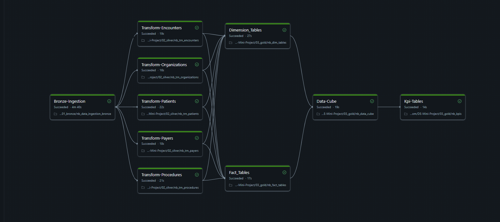

# Medical Data Documentation

**Github Repository Link:** [DE-Mini-Project](https://github.com/jagdisheverest2004/DE-Mini-Project)

<br>

## Data Pipeline Overview

The project follows the Medallion Architecture and transforms raw healthcare data into analytics‑ready KPIs.  
The flow:

**Raw Files → Bronze → Silver → Gold (Facts & Dimensions) → Data Cube → KPI Views**

The system processes six operational medical datasets:  
encounters, organizations, patients, payers, procedures, data_dictionary.

Azure Blob Storage is used as the raw data input.

<br>

## Bronze Layer – Raw Landing Zone

**Notebook:** `01_bronze/nb_data_ingestion_bronze`

The Bronze layer acts as the unmodified landing zone.  
All datasets are ingested exactly as received from Azure Blob Storage:

* schema preserved as in source  
* raw timestamps retained  
* raw text formatting, casing, special characters preserved  

This layer serves as a historical archive and point of auditing.

#### Source Files Ingested
The pipeline loads 6 CSV files from Azure Blob Storage container `dataingestioncontainer`:

1. **data_dictionary.csv** - Data dictionary for reference
2. **encounters.csv** - Patient encounters with healthcare providers
3. **organizations.csv** - Healthcare organizations and facilities
4. **patients.csv** - Patient demographic information
5. **payers.csv** - Insurance payers and coverage providers
6. **procedures.csv** - Medical procedures performed

#### Bronze Storage Location
All raw files are stored in Unity Catalog volumes:  
`/Volumes/bronze_raw_medical_data/azure_blob_storage/raw_medical_data/raw_{filename}.csv`

Storage Account: `dataingestionmedical`  
Format: CSV with header, schema inference enabled

<br>

## Silver Layer – Detailed Transformations  

This layer performs complete cleaning, standardization, and validation of all Bronze tables.

#### General Operations Included
* Standardizes all column names to snake_case convention  
* Converts columns to proper data types (integers, floats, dates)  
* Cleans and formats text fields (trim spaces, handle inconsistencies)  
* Prepares data for dimensional modeling in Gold layer  

<br>

### Encounters Table Transformations  
**Notebook:** `02_silver/nb_trn_encounters`

**Source:** `/Volumes/bronze_raw_medical_data/azure_blob_storage/raw_medical_data/raw_encounters.csv`  
**Target:** `silver_medical_data.azure_blob_storage.silver_encounters`

#### Column Renaming (Snake Case)
* Id → id  
* start → start  
* STOP → stop  
* PATIENT → patient_id  
* organization → organization_id  
* PAYER → payer_id  
* ENCOUNTER_CLASS → encounter_class  
* CODE → code  
* DESCRIPTION → description  
* BASE_ENCOUNTER_COST → base_encounter_cost  
* TOTAL_CLAIM_COST → total_claim_cost  
* PAYER_COVERAGE → payer_coverage  
* REASONCODE → reason_code  
* REASONDESCRIPTION → reason_description  

#### Data Type Casting
* base_encounter_cost → double  
* total_claim_cost → double  
* payer_coverage → double  
* reason_code → double  
* code → long  

#### Business Logic
Captures complete encounter information including:  
* Encounter start and stop times  
* Patient and organization references  
* Payer and coverage amounts  
* Encounter classification and diagnosis codes  
* Cost breakdown (base cost, total claim, payer coverage)  

<br>

### Organizations Table Transformations  
**Notebook:** `02_silver/nb_trn_organizations`

**Source:** `/Volumes/bronze_raw_medical_data/azure_blob_storage/raw_medical_data/raw_organizations.csv`  
**Target:** `silver_medical_data.azure_blob_storage.silver_organizations`

#### Column Renaming (Snake Case)
* Id → organization_id  
* name → organization_name  
* ADDRESS → organization_address  
* CITY → organization_city  
* state → organization_state  
* ZIP → organization_zip  
* LAT → organization_lat  
* LON → organization_lon  

#### Business Logic
Provides healthcare organization master data including:  
* Organization identifiers and names  
* Complete address information (street, city, state, zip)  
* Geographic coordinates (latitude, longitude) for spatial analysis  

<br>

### Patients Table Transformations  
**Notebook:** `02_silver/nb_trn_patients`

**Source:** `/Volumes/bronze_raw_medical_data/azure_blob_storage/raw_medical_data/raw_patients.csv`  
**Target:** `silver_medical_data.azure_blob_storage.silver_patients`

#### Column Renaming (Snake Case)
* Id → patient_id  
* BIRTHDATE__ → birth_date  
* DEATH_DATE → death_date  
* PREFIX → prefix  
* FIRST → first_name  
* LAST → last_name  
* SUFFIX → suffix  
* MAIDEN → maiden  
* MARITAL_status → marital_status  
* race → race  
* ETHNICITY → ethnicity  
* gender → gender  
* BIRTH_PLACE → birth_place  
* ADDRESS → address  
* CITY_name → city_name  
* STATE → state  
* COUNTY → county  
* ZIP_CODE → zip_code  
* LAT → lat  
* LON → lon  

#### Data Type Casting & Advanced Transformations
* birth_date: Complex date parsing with multiple format support  
  * Trims whitespace from date strings  
  * Attempts parsing in multiple formats:  
    * yyyy-MM-dd  
    * dd-MM-yyyy  
    * MM-dd-yyyy  
  * Uses coalesce to handle different source formats  
  * Standardizes output to yyyy-MM-dd format  

#### Business Logic
Provides comprehensive patient demographics:  
* Unique patient identifier  
* Full name components (prefix, first, last, suffix, maiden)  
* Birth date (with robust parsing) and death date  
* Demographic attributes (race, ethnicity, gender, marital status)  
* Geographic information (address, city, state, county, zip, coordinates)  
* Birth place information  

<br>

### Payers Table Transformations  
**Notebook:** `02_silver/nb_trn_payers`

**Source:** `/Volumes/bronze_raw_medical_data/azure_blob_storage/raw_medical_data/raw_payers.csv`  
**Target:** `silver_medical_data.azure_blob_storage.silver_payers`

#### Column Renaming (Snake Case)
* Id → id  
* NAME → name  
* ADDRESS → address  
* CITY → city  
* STATE_HEADQUARTERED → state_headquartered  
* ZIP → zip  
* PHONE → phone  

#### Business Logic
Maintains insurance payer master data:  
* Payer identifiers and names  
* Headquarters location (address, city, state, zip)  
* Contact information (phone)  

<br>

### Procedures Table Transformations  
**Notebook:** `02_silver/nb_trn_procedures`

**Source:** `/Volumes/bronze_raw_medical_data/azure_blob_storage/raw_medical_data/raw_procedures.csv`  
**Target:** `silver_medical_data.azure_blob_storage.silver_procedures`

#### Column Renaming (Snake Case)
* START → start  
* stop → stop  
* PATIENT → patient_id  
* CODE → code  
* DESCRIPTION → description  
* BASE_COST → base_cost  
* REASONCODE → reason_code  
* REASONDESCRIPTION → reason_description  
* ENCOUNTER_ID → encounter_id  

#### Data Type Casting
* code → long  
* base_cost: Special handling  
  * Removes comma separators using regexp_replace  
  * Casts to float  

#### Business Logic
Tracks medical procedures performed:  
* Procedure start and stop times  
* Patient and encounter references  
* Procedure codes and descriptions  
* Cost information (with comma removal for proper numeric conversion)  
* Reason codes for procedure justification  

<br>

### Silver Output Summary
All five tables are now:  
**clean, standardized, typed correctly, and ready for dimensional modeling**

All tables use Delta format and are saved to `silver_medical_data.azure_blob_storage` catalog.

<br>

## Gold Layer – Dimensional Model  

Uses four notebooks to create fact and dimension tables:

* `03_gold/nb_dim_tables` - Creates dimension tables  
* `03_gold/nb_fact_tables` - Creates fact tables  
* `03_gold/nb_data_cube` - Creates denormalized analytics tables  
* `03_gold/nb_kpis` - Creates KPI views and business metrics  

<br>

### Dimension Tables – Detailed Logic  
**Notebook:** `03_gold/nb_dim_tables`

#### dim_patients
Derived from clean Silver patient data. Contains:  
* patient_id (primary key)  
* demographic attributes (birth_date, death_date, gender, race, ethnicity)  
* name components (prefix, first_name, last_name, suffix, maiden)  
* marital status  
* geographic attributes (address, city, state, county, zip, lat, lon)  
* birth_place  

#### dim_organizations
Derived from clean Silver organization data. Contains:  
* organization_id (primary key)  
* organization_name  
* complete address (organization_address, city, state, zip)  
* geographic coordinates (lat, lon) for location analysis  

#### dim_payers
Derived from clean Silver payer data. Contains:  
* payer_id (primary key)  
* payer name  
* headquarters location (address, city, state, zip)  

#### dim_procedures
Extracted from Silver procedures table. Contains:  
* encounter_id
* patient_id
* procedure_code
* procedure_code_description  

#### dim_encounters
Extracted from Silver encounters table. Contains:  
* encounter_id
* encounter_code
* encounter_class  
* encounter_code_description  

#### dim_calendar
Generated for every month in the calendar order. Includes attributes:  
* month  
* quarter  
* half_yearly

<br>

### Fact Tables – Detailed Logic  
**Notebook:** `03_gold/nb_fact_tables`

#### fact_encounters
The primary encounter fact table using:  
* encounter_id (primary key)  
* Foreign keys: patient_id, organization_id, payer_id
* Date keys: encounter_start_date, encounter_end_date  
* Measures:  
  * base_encounter_cost  
  * total_claim_cost  
  * payer_coverage  

This table powers:  
Encounter analytics, cost analysis, utilization metrics, payer performance.

#### fact_procedures
Procedure fact table includes:  
* patient_id
* encounter_id
* Date keys: procedure_start_date, procedure_end_date  
* Measures:  
  * base_procedure_cost  

Enables procedure volume analysis, cost tracking, and procedural outcomes.

<br>

## Data Cube Layer – Denormalized Analytics Tables  
**Notebook:** `03_gold/nb_data_cube`

This notebook creates wide, joined analytics-friendly tables used for dashboards.

#### Encounters-Join:- Merge Dim & Fact Encounters with other tables
Combines:  
* fact_encounters  
* dim_patients (demographics, location)  
* dim_organizations (provider details)  
* dim_payers (insurance information)  
* dim_encounters (encounter classification)  

#### Procedures-Join:- Merge Dim & Fact Procedures
Combines:  
* dim_procedures
* fact_procedures

#### SSOT (Single Source of Truth)
Combines both joined tables:  
* encounters-join  
* procedures-join

This becomes the unified table BI tools query for comprehensive healthcare analytics.

<br>

## KPI Layer – Business Metrics  
**Notebook:** `03_gold/nb_kpis`

This notebook produces business KPIs as SQL views and tables.

### KPI Descriptions

#### KPI-1: Encounter Mix by Encounter Class
Analyzes the distribution of encounter types (outpatient, inpatient, emergency, etc.) by grouping encounters by year and quarter. Calculates the percentage each encounter class represents within each quarter, enabling identification of seasonal patterns and service line utilization trends over time.

<br>

#### KPI-2: Encounters Over 24 Hours vs Under 24 Hours (%)
Categorizes encounters based on duration by calculating the time difference between start and stop timestamps. Groups encounters into two categories: "More than 24 hours" and "24 hours or less". Provides monthly percentage breakdown of short-term versus extended encounters for capacity planning and care complexity analysis.

<br>

#### KPI-3: Zero Payer Coverage Rate
Evaluates financial risk by identifying encounters with zero payer coverage (self-pay or uninsured patients) versus those with some insurance coverage. Uses a binary flag (0 or 1) based on payer_coverage amount, then calculates monthly percentage distribution to track uncompensated care trends.

<br>

#### KPI-4: Top 10 Procedures by Highest Average Base Cost
Identifies the most expensive procedures by calculating average base cost per procedure code, grouped by half-yearly periods. Orders results by highest average cost and total procedure volume, limiting output to the top 10 procedures to highlight high-value service lines and cost drivers.

<br>

#### KPI-5: Average Total Claim Cost by Payer
Compares cost patterns across insurance providers by calculating the mean total claim cost for each payer. Further segments results by encounter class and encounter code to enable granular analysis of payer-specific cost variations and reimbursement patterns across different types of care.

<br>

#### KPI-6: 30-Day Patient Readmission Rate
Measures care quality and coordination by tracking patients who return within 30 days of discharge. Uses window functions (LAG) to retrieve each patient's previous encounter stop date, calculates day difference between encounters, identifies eligible readmissions (non-overlapping encounters within 30 days), and produces monthly readmission percentage rates.

<br>

## Pipeline Orchestration (YAML Workflow)

**File:** `medical_data_pipeline.yaml`

The pipeline runs in this order:
<br>



**Execution Flow:**

1. **Bronze-Ingestion** - Loads all 6 CSV files from Azure Blob Storage
2. **Silver Transformation (Parallel)** - All 5 entity transformations run in parallel after bronze completes
3. **Gold Modeling (Parallel)** - Dimension and Fact tables created in parallel after silver layer completes
4. **Data-Cube** - Creates denormalized wide tables after dimensions and facts exist
5. **Kpi-Tables** - Generates all KPI views after data cube is available

Each stage depends on the previous stage's successful execution, preventing invalid data from reaching analytics.

**Job Configuration:**
* Job Name: Medical_Data_Pipeline  
* Queue Enabled: true  
* Performance Target: PERFORMANCE_OPTIMIZED  
* All tasks use WORKSPACE source notebooks  

<br>

## Data Quality & Validation

The pipeline ensures data quality through:

* **Bronze Layer**: Raw data preservation for audit trail  
* **Silver Layer**: Data type validation, format standardization, null handling  
* **Gold Layer**: Referential integrity through foreign key relationships  

<br>

## Catalog Structure

```
Unity Catalog
├── bronze_raw_medical_data
│   └── azure_blob_storage
│       └── raw_medical_data (Volume)
│           ├── raw_encounters.csv
│           ├── raw_organizations.csv
│           ├── raw_patients.csv
│           ├── raw_payers.csv
│           ├── raw_procedures.csv
│           └── raw_data_dictionary.csv
│
├── silver_medical_data
│   └── azure_blob_storage
│       ├── silver_encounters (Delta)
│       ├── silver_organizations (Delta)
│       ├── silver_patients (Delta)
│       ├── silver_payers (Delta)
│       └── silver_procedures (Delta)
│
└── gold_medical_data (planned)
    └── dim_tables
        ├── dim_patients
        ├── dim_organizations
        ├── dim_payers
        ├── dim_procedures
        ├── dim_encounters
        ├── dim_calendar
    └── fact_tables
        ├── fact_procedures
        ├── fact_encounters
    └── data_cubes
        ├── medical_data_cube

```